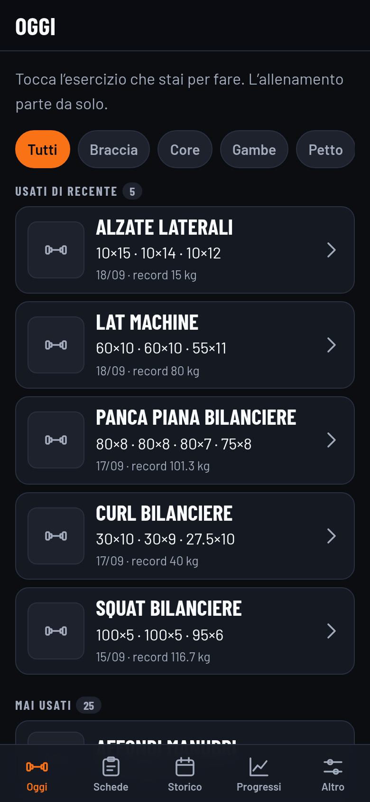

# Palestra — registro allenamenti

App web installabile sul telefono per registrare **esercizi, pesi e ripetizioni**.
Funziona **senza rete** in palestra, i dati restano **solo sul tuo dispositivo**,
non c'e' nessun account e nessun server.



## Come si usa

Il pannello principale e' la lista dei tuoi esercizi, a caratteri grandi, con
sotto **i carichi dell'ultima volta**. Tocchi quello che stai per fare, si apre
il pannello di registrazione, premi + o − e registri. Tre tocchi.

- **L'allenamento parte da solo** con la prima serie: nessun pulsante "Inizia"
  da ricordarsi. Si chiude da solo dopo 15 minuti che non registri niente (il
  tempo e' regolabile in **Altro**).
- Se si chiude mentre ti stai ancora allenando — capita, un recupero lungo
  basta — in cima al pannello compare **Riprendi**, che lo riapre dov'era
  invece di spezzarlo in due nello storico.
- Gli esercizi sono ordinati per **ultimo usato**: quelli che fai davvero stanno
  in cima, gli altri 800 restano dietro a "Cerca".
- I chip in alto filtrano per gruppo muscolare.

## Cosa fa

- **Pulsanti + e − grandi** per peso e ripetizioni, a passi di 2,5 kg
  (regolabili). Se tocchi il numero si apre la tastiera per il valore esatto.
- **Schede** (Push / Pull / Gambe gia' pronte): quando ne apri una, i suoi
  esercizi vanno in cima al pannello sotto "Ancora da fare".
- **876 esercizi con foto**, ricercabili in italiano ("panca", "stacco",
  "trazioni"), con le istruzioni di esecuzione.
- **Timer di recupero** che parte da solo quando registri una serie, con suono e
  vibrazione. Il conto alla rovescia si vede anche dentro il pannello.
- **Suggerimento carico e record**: sotto ogni esercizio l'ultima volta, e la
  serie che batte il tuo massimale stimato si marca da sola.
- **Progressi**: grafici di peso massimo, massimale stimato (Epley) e volume.
- **Riscaldamento, RPE e note** per ogni serie: il riscaldamento non sporca i
  totali.
- **Battito cardiaco** da Apple Watch (via Salute), da fascia Bluetooth in
  diretta, o scritto a mano.
- **Backup** in un file JSON che esporti e reimporti quando vuoi.

## Installarla sul telefono

Serve un indirizzo **https** (una pagina web normale): le app installabili non
funzionano da file locale, e senza https non partono ne' il service worker ne'
il Bluetooth.

Questo repository pubblica gia' su GitHub Pages dal ramo **`gh-pages`**
(`https://megagiov.github.io/ginevra/`). Per mettere online l'app basta copiare
la cartella `palestra/` su quel ramo: finisce in
`https://megagiov.github.io/ginevra/palestra/` **senza toccare il sito che sta
gia' nella radice**.

```bash
git checkout gh-pages
git checkout <ramo-con-l-app> -- palestra/
git commit -m "Pubblica l'app Palestra"
git push origin gh-pages
```

Poi dal telefono apri `https://megagiov.github.io/ginevra/palestra/`:

- **iPhone (Safari)**: tasto Condividi -> *Aggiungi a Home*.
- **Android (Chrome)**: menu -> *Installa app*.

Va bene qualunque altro hosting statico in https: la cartella `palestra/` e'
autosufficiente, si copia dov'e' e funziona.

Da li' in poi si apre a schermo intero come un'app e funziona anche in modalita'
aereo. La prima apertura con rete scarica il catalogo esercizi (circa 1 MB) e lo
tiene salvato; le foto si salvano man mano che le apri.

Per provarla sul computer basta un server statico nella cartella:

```bash
cd palestra
python3 -m http.server 8777
# poi apri http://127.0.0.1:8777
```

## I tuoi dati

Stanno in **IndexedDB**, cioe' nella memoria del browser di quel dispositivo.
Non vanno da nessuna parte: nessuna sincronizzazione, nessun cloud, nessuno che
li legge. Il rovescio della medaglia e' che **se cancelli i dati del browser o
disinstalli l'app, spariscono**.

Quindi: **Altro → Esporta backup**, ogni tanto. Produce un file
`palestra-backup-AAAA-MM-GG.json` che puoi salvare dove vuoi e rimettere dentro
con *Importa backup* (ti chiede se sostituire tutto o unire).

## Battito cardiaco

Mettiamo in chiaro una cosa, perche' cambia tutto: **nessun browser puo' leggere
HealthKit**. Non e' una mancanza di questa app, e' che un'API web per entrare
nell'app Salute non esiste, ne' su Safari ne' altrove. Un'app che leggesse il
battito dell'Apple Watch in diretta va scritta in Swift, con Xcode e un account
sviluppatore Apple: e' un altro progetto, non una pagina web.

Detto questo, le strade che **funzionano davvero** sono tre.

### 1. Apple Watch, dopo l'allenamento (Comandi rapidi)

Ti alleni con l'app **Allenamento** dell'orologio come fai di solito, poi porti
i dati qui con un Comando rapido. Si prepara una volta sola.

1. Su iPhone apri **Comandi rapidi** → nuovo comando.
2. **Trova campioni di salute**: tipo *Frequenza cardiaca*, filtro sulla *Data
   di inizio* (per esempio "ultime 24 ore"), ordinati per data.
3. **Ripeti con ciascuno** e dentro **Ottieni dettagli del campione**: prendi
   *Valore* e *Data di inizio*. Formatta la data come `yyyy-MM-dd HH:mm:ss`.
4. Costruisci un testo con una riga per campione, nella forma `data,valore`.
5. **Salva file**.
6. Nell'app: **Altro → Importa da Salute**, scegli quel file.

I battiti si agganciano da soli agli allenamenti giusti confrontando gli orari,
e li vedi nello storico con media, massimo e grafico.

> I nomi delle azioni cambiano un po' fra le versioni di iOS. Non serve che il
> file sia esattamente in quel formato: l'import accetta **JSON o CSV**, con date
> ISO (`2026-09-21T18:03:12`) o italiane (`21/09/2026, 18:03`). Se c'e' una
> colonna con la data e una con il valore, funziona.

### 2. Fascia cardio Bluetooth, in diretta

Se hai una fascia toracica (Polar, Garmin, Decathlon…) l'app la legge in diretta
e vedi i bpm mentre ti alleni, con la zona di sforzo. Usa lo standard Bluetooth
*Heart Rate Service*.

Funziona su **Chrome/Edge** (Android, Mac, Windows). **Non su Safari iPhone**,
che il Bluetooth dal web non lo espone proprio. Vale anche per l'Apple Watch se
usi un'app che lo fa trasmettere come cardiofrequenzimetro BLE.

### 3. A mano

Guardi media e massimo sull'orologio a fine allenamento e li scrivi:
**Battito cardiaco → Inserisci a mano**. Due numeri, cinque secondi.

Se metti la tua eta' in **Altro**, l'app calcola anche le zone di sforzo
(frequenza massima stimata come 220 meno l'eta': una formula grossolana, va
presa per quello che e').

## Catalogo esercizi

Le schede con foto e istruzioni vengono da
[free-exercise-db](https://github.com/yuhonas/free-exercise-db) (876 esercizi,
873 con foto), rilasciato in **dominio pubblico (Unlicense)**: si puo' usare
liberamente, anche per cose commerciali.

Il file `data/catalog.json` e' generato, non scritto a mano. Per rigenerarlo:

```bash
node tools/build-catalog.js
```

Lo script traduce in italiano i vocabolari chiusi (muscoli, attrezzi, categorie)
e costruisce le chiavi di ricerca italiane. **I nomi degli esercizi restano in
inglese**: tradurne 876 a macchina avrebbe prodotto italiano sbagliato, e in
palestra meta' di quei nomi si dicono comunque in inglese. I 30 esercizi delle
schede di partenza hanno invece il nome italiano scritto a mano, agganciato alla
foto giusta del catalogo.

Le foto **non sono nel repository**: restano sul CDN e il service worker le
salva man mano che le apri. Scaricarle tutte sarebbero decine di MB per foto che
non guarderai mai.

Le icone dell'app sono generate anche loro:

```bash
node tools/make-icons.js
```

## Com'e' fatta dentro

Niente framework, niente build, niente `node_modules`: si apre e va.

| File | Cosa fa |
|---|---|
| `index.html` | Guscio: barre, icone SVG, contenitore della vista |
| `app.css` | Tema scuro con token semantici, target di tocco da 44px, safe area |
| `js/db.js` | IndexedDB: esercizi, schede, sessioni, serie, impostazioni |
| `js/app.js` | Pannello a lista, registrazione, viste, eventi su `data-act` |
| `js/catalog.js` | Ricerca nel catalogo, caricato solo quando serve |
| `js/hr.js` | Battito: Bluetooth, import da Salute, statistiche e zone |
| `js/chart.js` | Grafici a linea in SVG, scritti a mano |
| `js/seed.js` | I 30 esercizi e le 3 schede di partenza |
| `sw.js` | Service worker: guscio in cache, catalogo, foto |

## Limiti, detti chiaramente

- **I dati stanno su un solo dispositivo.** Niente sincronizzazione fra telefono
  e computer: si passa dal file di backup.
- **Il battito dell'Apple Watch non e' in diretta.** Arriva dopo, dal file dei
  Comandi rapidi. In diretta serve una fascia Bluetooth e un browser che non sia
  Safari.
- **Le istruzioni degli esercizi sono in inglese**, come nel dataset originale.
- **Il massimale e' una stima** (formula di Epley), non un massimale vero.
- Il catalogo va scaricato **una prima volta con la rete**. Dopo resta salvato.
